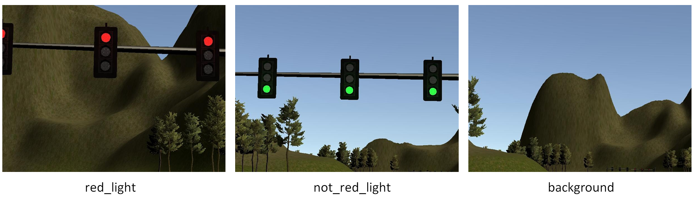

# Udacity Self Driving Car Nanodegree
## Capstone Project

### Overview

This is the Capstone for Udacity's Self Driving Car Nanodegree. The objective is to write ROS nodes to implement core functionality of the autonomous vehicle system, including traffic light detection, control, and waypoint following.

---

### Video Demo


---

### Background

Shown below is a system architecture diagram showing the ROS nodes and topics used in the project.


---

### Implementation Summary

**Traffic Light Classification**

A convolutional neural network (CNN) model is used for the classification of traffic lights. The model is trained with TensorFlow to classify 3 classes, namely `red_light`, `not_red_light`, and `background`. 

Sample images of the 3 classes is as shown below



The TensorBoard visualization of the model is as shown below:


Each convolutional layer is using kernel size of `5x5` with `same padding`. And each pooling layer is using `max pooling` with kernel size of `2x2` and stride of `2`.

The model's size for some of the critical layers are as depicted below:

Layer     |    Size     |
----------|-------------|
input|(1, 160, 576, 3)
dropout1|(1, 80, 288, 8)
dropout2|(1, 40, 144, 8)
dropout3|(1, 20, 72, 32)
flatten4|(1, 46080)
dropout4|(1, 256)
dropout5|(1, 256)
logits|(1, 3)

The model is trained with training set and validation set as shown in table below. 

<table>
    <thead>
        <tr>
            <th></th>
            <th>Class</th>
            <th>Sample Size</th>
        </tr>
    </thead>
    <tbody>
        <tr>
            <td rowspan=3>Train</td>
            <td>red_light</td>
            <td>272</td>
        </tr>
        <tr>
            <td>not_red_light</td>
            <td>310</td>
        </tr>
        <tr>
            <td>background</td>
            <td>310</td>
        </tr>
        <tr>
            <td rowspan=3>Validation</td>
            <td>red_light</td>
            <td>90</td>
        </tr>
        <tr>
            <td>not_red_light</td>
            <td>85</td>
        </tr>
        <tr>
            <td>background</td>
            <td>82</td>
        </tr>
    </tbody>
</table>

The hyperparameters used during training is as follows: 

|Hyperparameters          |   Value     |
|-------------------------|-------------|
|Batch Size               |   20        |
|L2 weight regularization |   5e-2      |
|Dropout rate             |   0.7       |
|Learning rate            |   5e-4      |
|Batch Size               |   20        |

Validation classification rate of 100% is achieved at epoch 40.

**Decision making**

When the vehicle current position is within 150 waypoints from the next traffic light, the live image stream will be used for traffic light classification using the CNN model trained.

If classification output is `red_light`, the traffic light detector, `tl_detector` will publish the next traffic light stop point in the `/traffic_waypoint` topic. Thus, the vehicle will decelerate gradually until it reaches 3 waypoints ahead of the next traffic light waypoint.

Otherwise, `tl_detector` will publish the endpoint of the track in the `/traffic_waypoint` topic. Thus, the vehicle will continue to move with constant throttle of `0.2` until it reaches the end of the track.

---

### Installation

Please use **one** of the two installation options, either native **or** docker installation.

### Native Installation

* Be sure that your workstation is running Ubuntu 16.04 Xenial Xerus or Ubuntu 14.04 Trusty Tahir. [Ubuntu downloads can be found here](https://www.ubuntu.com/download/desktop).
* If using a Virtual Machine to install Ubuntu, use the following configuration as minimum:
  * 2 CPU
  * 2 GB system memory
  * 25 GB of free hard drive space

  The Udacity provided virtual machine has ROS and Dataspeed DBW already installed, so you can skip the next two steps if you are using this.

* Follow these instructions to install ROS
  * [ROS Kinetic](http://wiki.ros.org/kinetic/Installation/Ubuntu) if you have Ubuntu 16.04.
  * [ROS Indigo](http://wiki.ros.org/indigo/Installation/Ubuntu) if you have Ubuntu 14.04.
* [Dataspeed DBW](https://bitbucket.org/DataspeedInc/dbw_mkz_ros)
  * Use this option to install the SDK on a workstation that already has ROS installed: [One Line SDK Install (binary)](https://bitbucket.org/DataspeedInc/dbw_mkz_ros/src/81e63fcc335d7b64139d7482017d6a97b405e250/ROS_SETUP.md?fileviewer=file-view-default)
* Download the [Udacity Simulator](https://github.com/udacity/CarND-Capstone/releases).

### Docker Installation
[Install Docker](https://docs.docker.com/engine/installation/)

Build the docker container
```bash
docker build . -t capstone
```

Run the docker file
```bash
docker run -p 4567:4567 -v $PWD:/capstone -v /tmp/log:/root/.ros/ --rm -it capstone
```

### Usage

1. Clone the project repository
```bash
git clone https://github.com/udacity/CarND-Capstone.git
```

2. Install python dependencies
```bash
cd CarND-Capstone
pip install -r requirements.txt
```
3. Make and run styx
```bash
cd ros
catkin_make
source devel/setup.sh
roslaunch launch/styx.launch
```
4. Run the simulator

